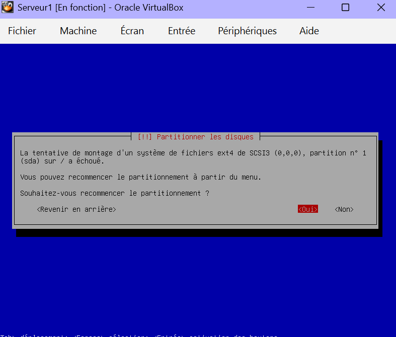
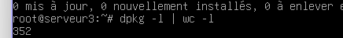
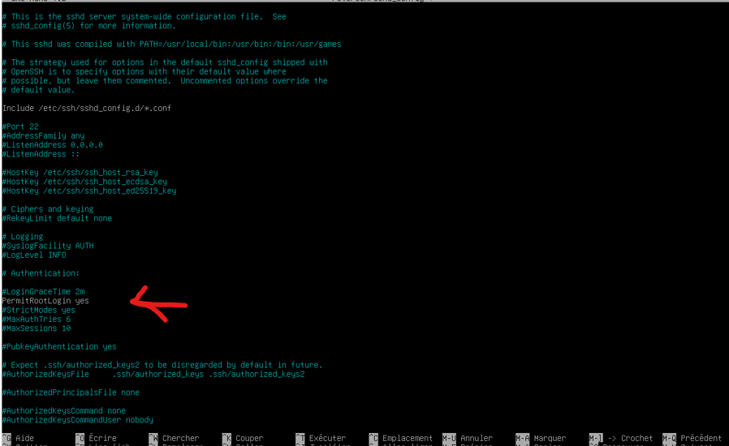
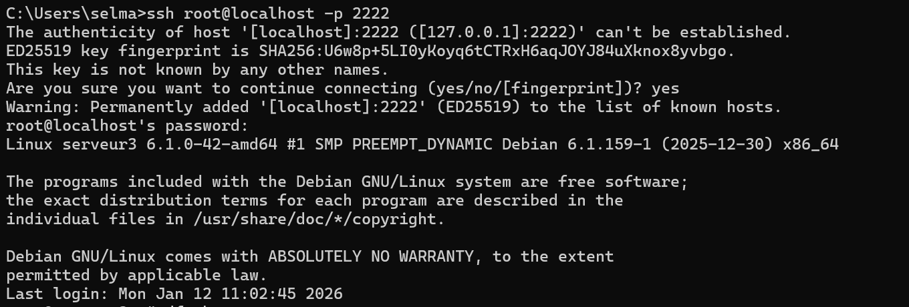
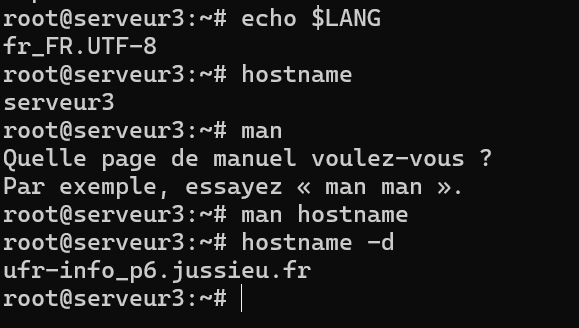
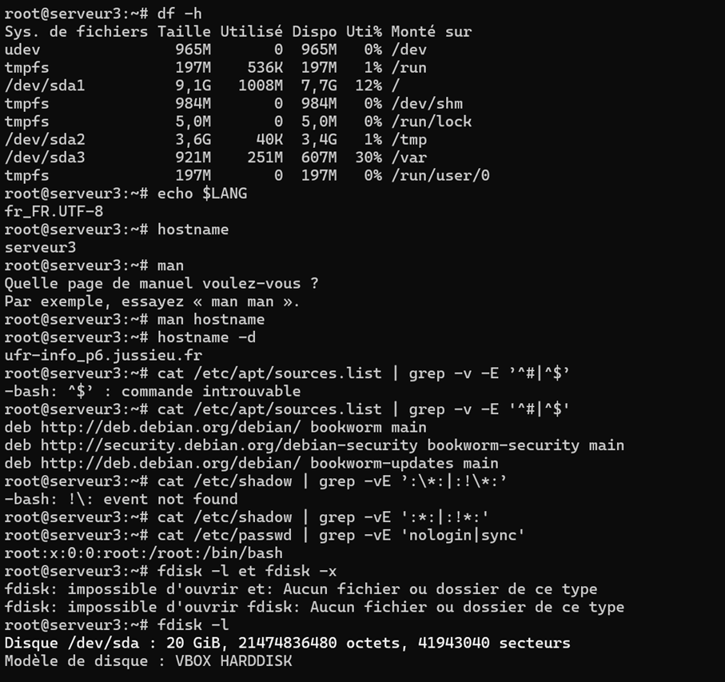
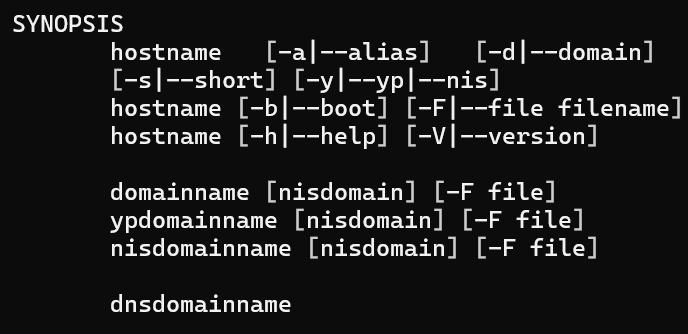

# TP1-Serveur Unix 

# TP 01 : Installation Serveurs UNIX

**Étudiante :** SAHRAOUI Selma
**Formation :** LP Projet Web et Mobile 
**Enseignant :** M. Le Cocq

---


## 1. Installation de la Machine Virtuelle

### 1.1 Première tentative (Serveur 1)
Pour commencer ce TP, j'ai créé une première machine virtuelle nommée `serveur1` sous Linux Debian (64-bit). J'ai suivi les étapes de configuration initiales, mais j'ai rencontrée des difficultés lors de l'étape critique du partitionnement des disques. Comme le montre la capture ci-dessous, je n'arrivais pas à valider la structure demandée.




### 1.2 Installation réussie (Serveur 3)
Suite à vos conseils, j'ai repris la procédure à zéro en créant une nouvelle machine propre nommée `serveur3`.
* **ISO utilisée :** `mini.iso` (NetBoot) pour une installation minimale.
* **Partitionnement :** J'ai cette fois réussi à configurer la table de partition **GPT** et à créer les 4 partitions demandées (`/`, `/var/log`, `/tmp`, `swap`).

L'installation du système de base a pris un certain temps (téléchargement des paquets), mais tout s'est déroulé sans erreur.

### 1.3 Vérification post-installation
Une fois l'installation terminée, j'ai vérifié le nombre de paquets installés pour m'assurer que le système était bien "minimal".
Commande utilisée : `dpkg -l | wc -l`
**Résultat :** J'ai obtenu **352 paquets**, ce qui est cohérent pour une installation légère.



---

## 2. Configuration SSH et Connexion

Pour administrer le serveur à distance, j'ai dû installer et configurer le service SSH. Pour cette partie, je me suis aidée de la documentation communautaire Ubuntu-fr [1].

### 2.1 Installation et modification
J'ai installé le serveur via la commande `apt install openssh-server`.
Par défaut, le compte `root` est désactivé pour la connexion à distance par sécurité. Pour permettre la connexion (comme demandé dans le TP), j'ai édité le fichier de configuration :

1.  Ouverture du fichier : `nano /etc/ssh/sshd_config`
2.  Modification de la ligne `#PermitRootLogin prohibit-password` en :
    ```text
    PermitRootLogin yes
    ```
3.  Redémarrage du service : `systemctl restart ssh`




### 2.2 Connexion depuis l'hôte
Une fois la redirection de port configurée dans VirtualBox (Port 2222 vers Port 22), j'ai pu me connecter depuis mon terminal Windows avec la commande suivante :

```bash
ssh root@localhost -p 2222


```




## 3\. Analyse des commandes et résultats

  

Voici les informations relevées sur le système à l'aide des commandes demandées.

-   **Langue du système (**`**echo $LANG**`**) :** La commande retourne `fr_FR.UTF-8`. Elle permet d'afficher les informations de la langue utilisée par l'utilisateur.
Cela confirme que le système utilise le français et l'encodage de caractères UTF-8. J'ai validé cette information via un forum spécialisé \[2\].
-   **Nom de la machine (**`**hostname**`**) :** Le système répond `serveur3`, ce qui correspond bien au nom donné lors de l'installation.
-   **Domaine DNS :** En consultant le man (`man hostname`), j'ai trouvé l'option `-d`. La commande `hostname -d` me renvoie bien : `ufr-info-p6.jussieu.fr`.
-   **Vérification des dépôts (**`**sources.list**`**) :** La commande `cat /etc/apt/sources.list | grep -v -E '^#|^$'` permet d'afficher uniquement les dépôts actifs (en masquant les commentaires `#` et les lignes vides). **Interprétation :** On constate que le système va chercher ses mises à jour sur le miroir `debian.org` configuré durant l'installation.
-   **Sécurité des mots de passe (**`**/etc/shadow**`**) :** La commande filtrée sur `/etc/shadow` montre uniquement les utilisateurs possédant un mot de passe chiffré utilisable. **Résultat :** Seul l'utilisateur `root` apparaît, ce qui confirme que je n'ai pas créé d'utilisateur "invité" superflu, respectant ainsi la consigne stricte du TP.
-   **Espace disque (**`**df -h**`**) :** Cette commande montre l'occupation des partitions. **Analyse :** La partition racine `/` n'utilise que **1008 Mo** sur les 10 Go alloués. Cela confirme l'intérêt d'une installation NetBoot minimale qui économise beaucoup d'espace par rapport à une installation graphique classique.










  

## 4\. Aller plus loin

  

Pour approfondir les notions du TP, voici quelques recherches complémentaires.

### 4.1 Installation automatique (Preseed)

Le "Preseeding" est une méthode pour automatiser l'installation de Debian. Elle consiste à fournir un fichier de réponses (preseed.cfg) à l'installateur pour qu'il ne pose aucune question (langue, partitionnement, etc.). C'est très utile pour déployer des parcs de serveurs rapidement \[3\].

### 4.2 Rescue Mode (Mot de passe perdu)

Si l'on perd le mot de passe root, on peut redémarrer sur l'ISO d'installation et choisir le mode "Rescue". Cela permet d'ouvrir un terminal sur le système sans connaître le mot de passe, et de le changer via la commande `passwd` \[4\]. de cette facon `su motdepasseroot passwd nouveaumotdepasse`


### 4.3 Redimensionner une partition

Pour redimensionner la racine `/` sans réinstaller, il faut démarrer sur un LiveUSB (comme GParted) car on ne peut pas modifier une partition en cours d'utilisation. On utilise ensuite des outils comme `resize2fs` pour étendre le système de fichiers après avoir agrandi la partition \[5\].

### 4.4 Proxy

Pour qu'un serveur puisse accéder à Internet derrière un proxy (comme à la fac), on définit des variables d'environnement.

-   **Pour le shell** (dans `/etc/profile`) : `export http_proxy="http://proxy...:3128"`
-   **Pour APT** (dans `/etc/apt/apt.conf`) : `Acquire::http::Proxy "http://proxy...:3128/";` \[6\].

  

### Sources consultées

-   \[1\] Guide OpenSSH Server - _doc.ubuntu-fr.org_
-   \[2\] Explication variable LANG - _forum.ubuntu-fr.org_
-   \[3\] Automatisation Preseed - _Wiki Debian_
-   \[4\] Réinitialiser mot de passe Root - _debian-fr.org_
-   \[5\] Documentation GParted
-   \[6\] Configuration Proxy APT - _Wiki Debian_
